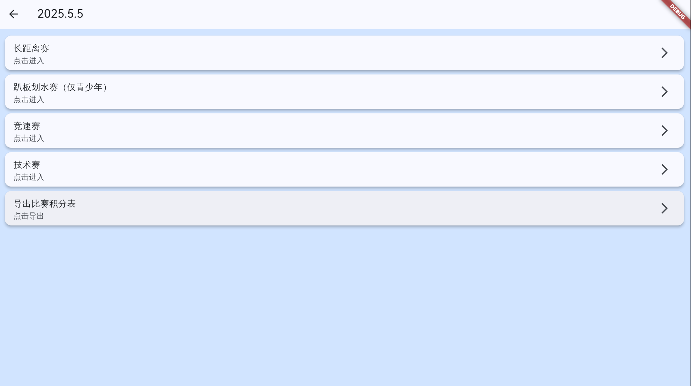
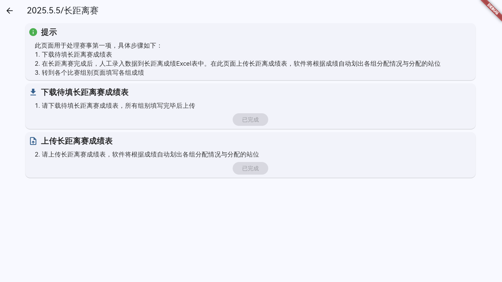
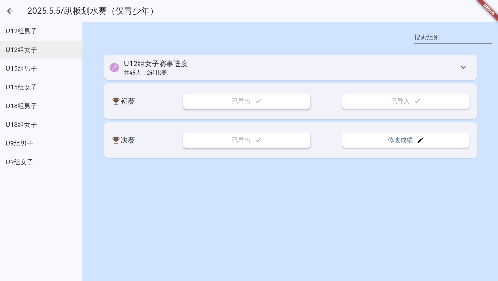

# PaddleScoreApp

The Paddle Score App is designed for paddleboarding events, featuring group categorization, score import and ranking, points calculation, and scheduling. With its user-friendly interface and efficient data processing, it aids organizers in managing event processes effortlessly, enhancing overall event management efficiency.

## This project is under development

## Snapshot

