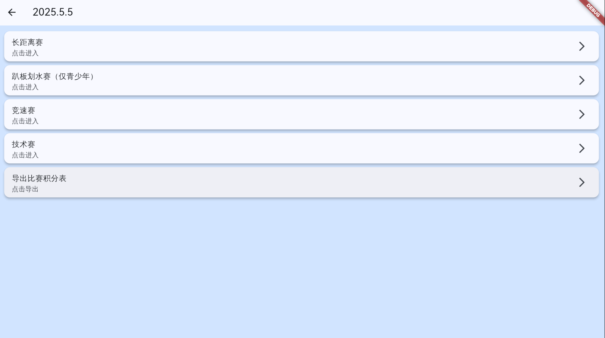
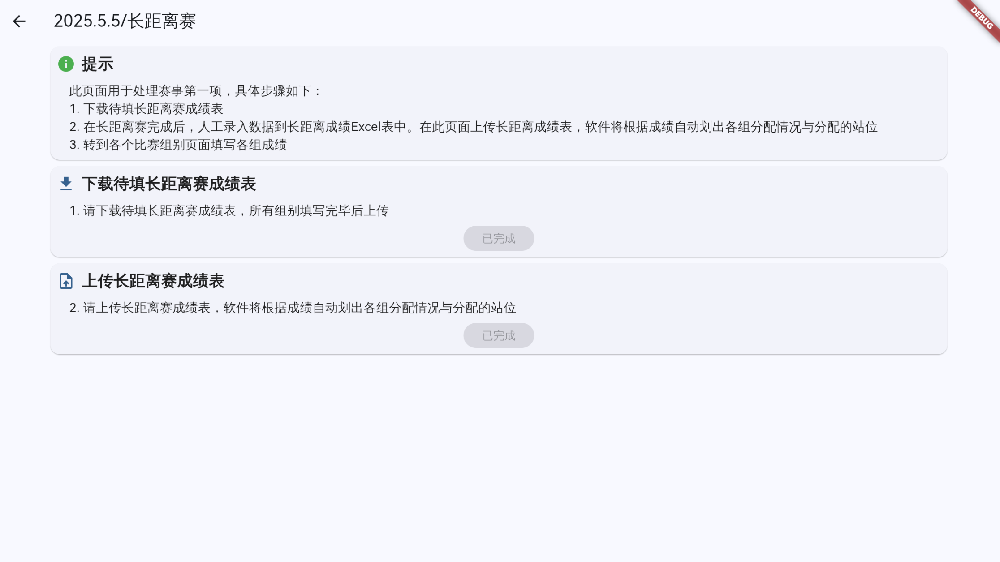
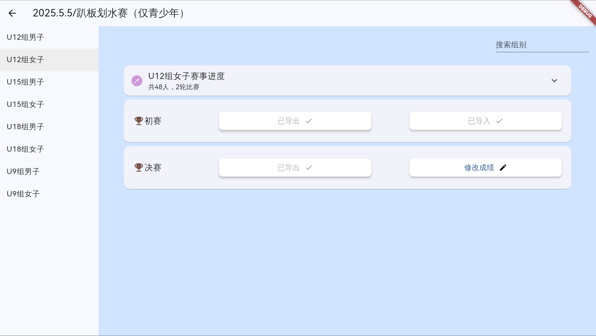

<div align="center">

# PaddleScoreApp

**面向桨板赛事组织者的 Flutter 计分与编排工具**

从报名表校验、分组晋级、成绩导入，到最终积分导出，把一场比赛的录入流程放进同一套桌面工作流里。

<p>
  
  
  
  
  
</p>

<p>
  <a href="#overview">项目简介</a> ·
  <a href="#features">核心功能</a> ·
  <a href="#workflow">流程概览</a> ·
  <a href="#quick-start">快速开始</a> ·
  <a href="#screenshots">界面预览</a> ·
  <a href="#structure">目录结构</a>
</p>

</div>

> [!WARNING]
> 当前仓库仍处于持续开发阶段。部分规划中的功能还没有全部落地。并且，未经过完备的测试，建议使用前先进行验证。

<a id="overview"></a>

## 项目简介

`PaddleScoreApp` 是一个面向桨板赛事的本地化计分工具，使用 Flutter 构建，围绕 `Excel + SQLite` 的赛事流程工作。

它的目标不是做一个通用表单系统，而是直接服务比赛组织场景：

- 创建赛事并生成本地数据库
- 下载并填写报名模板
- 校验报名表字段合法性
- 按项目与人数自动拆分赛程
- 导入各轮成绩并推进晋级
- 按组别或代表队导出最终积分表

当前项目已围绕以下项目建立主要流程：

- 长距离赛
- 趴板划水赛（仅青少年）
- 竞速赛
- 技术赛

<a id="features"></a>

## 核心功能

| 模块 | 说明 |
| --- | --- |
| 赛事创建向导 | 支持下载报名模板、上传报名表、检查数据、配置每组人数并创建赛事数据库 |
| 报名表校验 | 检查编号是否重复、是否为纯数字、组别命名是否合法、姓名与队伍是否为空 |
| 长距离赛处理 | 生成长距离成绩登记表，导入成绩后写入积分，并作为后续项目的前置进度 |
| 短距离项目流程 | 按组别和赛程生成分组表，支持趴板、竞速、技术赛各轮次成绩导入 |
| 积分导出 | 支持按组别或按代表队导出最终成绩表，并可选择是否计算青年组趴板分数 |
| 本地赛事归档 | 每场赛事使用独立 SQLite 数据库存储，方便持续录入与后续追踪 |

<a id="workflow"></a>

## 流程概览


```mermaid
flowchart LR
  A["创建赛事"] --> B["下载报名模板"]
  B --> C["填写并上传报名表"]
  C --> D["校验组别 / 编号 / 姓名 / 队伍"]
  D --> E["配置各项目每组人数"]
  E --> F["创建本地 SQLite 赛事库"]
  F --> G["生成并导入长距离成绩"]
  G --> H["进入趴板 / 竞速 / 技术赛"]
  H --> I["按轮次生成分组表并导入成绩"]
  I --> J["导出最终积分表"]
```

### 使用方式

1. 在首页输入赛事名称，进入创建流程。
2. 下载应用提供的报名模板并填写运动员信息。
3. 上传报名表，确认组别解析结果和错误检查项。
4. 设置趴板、竞速、技术赛每组人数并创建赛事。
5. 先处理长距离赛成绩，再进入后续短距离项目。
6. 全部录入完成后导出最终积分表。

<a id="quick-start"></a>

## 快速开始

### 环境要求

- Flutter Stable
- Dart SDK `>= 3.6.0`
- 已启用你要运行的平台支持，推荐优先使用 Windows 桌面环境

### 获取项目

```bash
git clone https://github.com/Apricityx/PaddleScoreApp.git
cd PaddleScoreApp
flutter pub get
```

### 运行项目

```bash
flutter run -d windows
```

如果你希望运行到其他平台，可以改用对应设备，例如：

```bash
flutter run -d linux
flutter run -d macos
```

> [!NOTE]
> 仓库当前可以打包 `android/` 平台产物，但现有功能流和文件处理方式更偏向桌面端使用；README 中的运行示例因此以桌面平台为主。

### 构建产物

```bash
flutter build windows
flutter build apk
```

> [!TIP]
> 项目包含一个本地维护的 `excel` 依赖分支，位于 `fork/excel-4.0.6`，用于提供对 wps 的 excel 格式读取。拉取仓库后直接执行 `flutter pub get` 即可。

<a id="screenshots"></a>

## 界面预览

<table>
  <tr>
    <td></td>
    <td></td>
  </tr>
  <tr>
    <td align="center"><sub>首页与赛事入口</sub></td>
    <td align="center"><sub>创建赛事向导</sub></td>
  </tr>
  <tr>
    <td></td>
    <td></td>
  </tr>
  <tr>
    <td align="center"><sub>赛事项目入口</sub></td>
    <td align="center"><sub>成绩录入与流程推进</sub></td>
  </tr>
</table>

<a id="structure"></a>

## 目录结构

```text
.
|-- android/
|-- docs/
|   |-- image/
|   |-- database.md
|   |-- pages.md
|   `-- race.md
|-- fork/
|   `-- excel-4.0.6/
|-- lib/
|   |-- assets/
|   |-- pageWidgets/
|   |   |-- appEntrances/
|   |   |-- longDistanceRace/
|   |   |-- shortDistanceRace/
|   |   `-- universalWidgets/
|   |-- utils/
|   |-- DataHelper.dart
|   `-- main.dart
|-- linux/
|-- macos/
|-- windows/
|-- pubspec.yaml
`-- README.md
```

### 主要代码区域

- `lib/pageWidgets/appEntrances/`: 首页、创建赛事、赛事入口、导出页、设置页
- `lib/pageWidgets/longDistanceRace/`: 长距离赛成绩导入与展示
- `lib/pageWidgets/shortDistanceRace/`: 趴板、竞速、技术赛流程与轮次组件
- `lib/utils/`: Excel 分析生成、数据库管理、路由、设置与通用方法
- `docs/`: 项目文档、截图、页面与业务说明

## 开发状态

- 已完成赛事创建、报名表校验、长距离成绩导入、项目入口与最终积分导出
- 已具备短距离项目的分组生成与阶段推进基础能力
- 仍在继续完善赛事列表管理、短距离分组展示、页面性能与本地进度体验

## License

This project is licensed under the GNU General Public License v3.0. See the [LICENSE](LICENSE) file for details.
